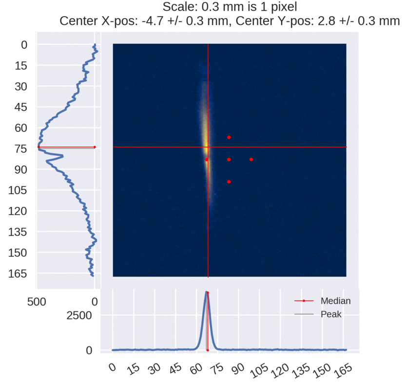
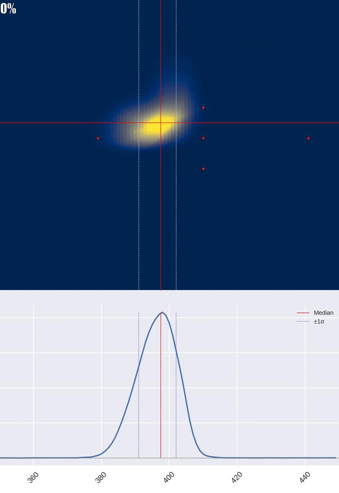

## Viewer image analysis for SECAR program 
### Example outputs:

 
 
### Packages needed:
matplotlib==2.2.4  
numpy==1.16.5  
scipy==1.2.2  
skimage==0.17.2  

### How to run:
1. *ssh -X secaruser@machine or e18514@machine* 
2. Module load anaconda/python3.7 (code will not work with python versions older than 3.7)
1. Input paths to images and necessary details in settings.py and im\_input.py
2. Run with *python im_analysis.py path/to/tune.tiff D1XXX*

### How it works 

Refer to SECAR optimizer [manual](https://github.com/pluflou/TuneOptimizer/blob/master/secar_optimizer_manual_v3.pdf).
